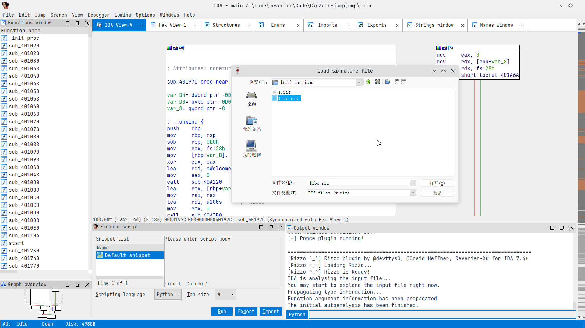
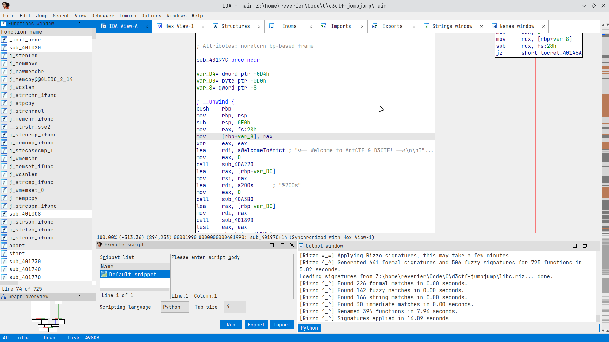
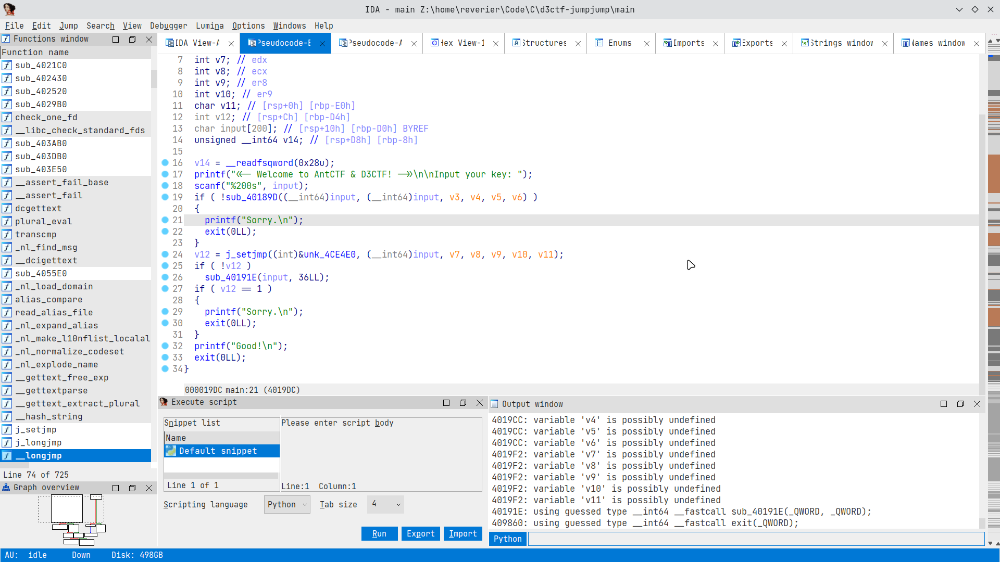
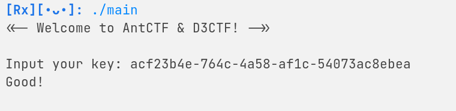

 

# D^3CTF Re jumpjump 解题思路

本题考查点是C语言标准库中`setjmp`与`longjmp`的逆向识别, 难度低. C++的异常处理就是依赖这两个函数进行实现的.

题目程序是`x86_64`架构的`elf`文件, 静态链接, 无符号表, 未加壳.

## 前置知识

`setjmp`库是一个类似于跨函数`goto`语句的实现, 利用`jmp_buf`来保存一个函数的状态, 在用户`setjmp`后可以通过`longjmp`函数快速跳转到`setjmp`函数所在的位置, 同时支持传递一个整数值. 在第一次`setjmp`时, 返回值恒为0. 在通过`longjmp`进行跳转时, `setjmp`的返回值为`longjmp`的第二个参数.

## 题解

将程序拖入到IDA中, 通过字符串窗口可以快速定位到主程序的位置`sub_40197C`, 同时可以通过程序中的静态字符串得知编译时静态链接的`libc`版本与发行版包版本, 为`glibc 2.33`. 通过镜像站或其他途径获得`libc`之后, 利用`rizzo`插件还原一部分符号信息. (当然如果熟悉C++异常处理或者`setjmp`库的底层实现的话也可以手动识别).





简单识别一下main函数里的各个函数:



可以发现程序对输入的flag进行了两次`check`, 一次是`sub_40189D`, 另一次利用setjmp设置跳转标志, 然后调用`sub_40191E`进行验证. 进入`sub_40189D`, 这里也通过`setjmp`设置了自动跳转:

```C
_BOOL8 __fastcall check1(char *input, __int64 a2, int a3, int a4, int a5, int a6)
{
  char v7; // [rsp+0h] [rbp-20h]
  int jmp_flag; // [rsp+1Ch] [rbp-4h]

  jmp_flag = j_setjmp((int)&jmp_buf_check1, a2, a3, a4, a5, a6, v7);
  if ( !jmp_flag )
    sub_401825((__int64)input);
  return jmp_flag == 36;
}
```

查看`sub_401825`函数:

```c
void __fastcall __noreturn sub_401825(const char* input)
{
  int input_len; // [rsp+1Ch] [rbp-4h]
  int i; // [rsp+1Ch] [rbp-4h]

  input_len = j_strlen_ifunc(input);
  if ( input_len != 36 )
    j_longjmp(&jmp_buf_check1, input_len);
  for ( i = 0; i <= 35; ++i )
    *(_BYTE *)(i + a1) ^= 0x57u;
  j_longjmp(&jmp_buf_check1, 36);
}
```

这两个函数结合起来就是测试输入长度是否为36. 如果为36则返回true, 否则返回false. 在检测长度的同时对输入数组进行异或操作.

接着看第二个`check`, 在main函数的过程中是这样的:

```c
  jmp_flag_main = j_setjmp((int)&jmp_buf_main, (__int64)input, v7, v8, v9, v10, v11);
  if ( !jmp_flag_main )
    check2(input, 36LL);
  if ( jmp_flag_main == 1 )
  {
    printf("Sorry.\n");
    exit(0LL);
  }
  printf("Good!\n");
  exit(0LL);
```

很显然在`check2`函数以及`check2`函数所调用的函数中通过跳转`jmp_buf_main`标志来将检测结果传递回来. 传递值为1时说明结果错误, 传递值为除了0(默认值为0)和1之外的其他值时说明结果正确.

`check2`函数很简单:

```c
void __fastcall __noreturn check2(__int64 a1, int a2)
{
  unsigned __int64 i; // [rsp+18h] [rbp-8h]

  for ( i = 0LL; i < a2; ++i )
    sub_4018E0((unsigned int)i, (*(char *)(a1 + i) + 4) ^ 0x33u);
  j_longjmp(&jmp_buf_main, 2);
}

__int64 __fastcall sub_4018E0(int a1, int a2)
{
  __int64 result; // rax

  result = dword_4CC100[a1];
  if ( a2 != (_DWORD)result )
    j_longjmp(&jmp_buf_main, 1);
  return result;
}
```

通过`sub_4018E0`对每一位进行检测, 如果不对就立即跳回main函数并输出.

主要的逻辑还是异或运算.

解密脚本十分简单, 提取出`dword_4CC100`数组:

```python
magic = [9,  11, 6,  90, 91, 10, 84, 5,  77, 87, 86, 84,
         11, 77, 84, 9,  85, 64, 77, 9,  6,  89, 11, 77,
         85, 84, 88, 87, 91, 9,  11, 64, 5,  10, 5,  9]
for i in magic:
    print(chr(((i ^ 0x33) - 4) ^ 0x57), end='')
print('')

# acf23b4e-764c-4a58-af1c-54073ac8ebea
```

验证:



## 题目源码

```c
// Created by Reverier from L-team, 2021.02.24

// flag:  acf23b4e-764c-4a58-af1c-54073ac8ebea

#include <setjmp.h>
#include <stdio.h>
#include <stdlib.h>
#include <string.h>

static jmp_buf len_jmp;
static jmp_buf incoming;

static int magic[] = {9,  11, 6,  90, 91, 10, 84, 5,  77, 87, 86, 84,
                      11, 77, 84, 9,  85, 64, 77, 9,  6,  89, 11, 77,
                      85, 84, 88, 87, 91, 9,  11, 64, 5,  10, 5,  9};

// libc version, for rizzo.
static const char* libcs = "GNU C Library (GNU libc) release release version 2.33.\nCopyright (C) 2021 Free Software Foundation, Inc.\nThis is free software; see the source for copying conditions.\nThere is NO warranty; not even for MERCHANTABILITY or FITNESS FOR A\nPARTICULAR PURPOSE.\nCompiled by GNU CC version 10.2.0.\nlibc ABIs: UNIQUE IFUNC ABSOLUTE\nFor bug reporting instructions, please see:\n<https://bugs.archlinux.org/>.";

static const char* glibcs = "core/glibc 2.33-4";

void check_len_real(char* v1) {
    int i = strlen(v1);
    if (i != 36) {
        longjmp(len_jmp, i);
    } else {
        for (i = 0; i < 36; i++) {
            v1[i] ^= 0x57;
        }
        longjmp(len_jmp, 36);
    }
}

int check_len(char* v1) {
    int n = setjmp(len_jmp);
    if (!n) {
        check_len_real(v1);
    } else if (n != 36) {
        return 0;
    } else {
        return 1;
    }
}

void real_valid(int i, int n) {
    if (magic[i] != n) {
        longjmp(incoming, 1);
    } else
        return;
}

void valid(char* buf, int n) {
    for (size_t i = 0; i < n; i++) {
        real_valid(i, (buf[i]+4)^0x33);
    }
    longjmp(incoming, 2);
}

int main() {
    char buf[200];

    printf("<<- Welcome to AntCTF & D3CTF! ->>\n\nInput your key: ");
    scanf("%200s", buf);

    if (!check_len(buf)) {
        printf("Sorry.\n\n");
        exit(0);
    }
    int n = setjmp(incoming);
    if (!n) {
        valid(buf, 36);
    } else if (n == 1) {
        printf("Sorry.\n\n");
        exit(0);
    } else {
        printf("Good!\n\n");
        exit(0);
    }

    return 0;
}

```

